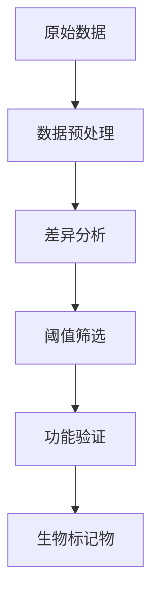

# 蛋白质组学数据分析方法

## 什么是蛋白质组学

蛋白质组学（Proteomics）是研究特定细胞、组织或生物体在特定条件下表达的所有蛋白质的科学。与基因组学不同，蛋白质组是动态变化的。

## 质谱数据分析流程

### 1. 原始数据处理

```python
class MassSpecProcessor:
    """质谱数据处理器"""
    
    def __init__(self, raw_file):
        self.raw_file = raw_file
        self.peak_data = None
        
    def convert_raw(self, output_format="mzML"):
        """转换原始文件格式"""
        print(f"转换 {self.raw_file} 到 {output_format} 格式")
        return f"converted.{output_format}"
    
    def peak_picking(self, noise_threshold=100):
        """峰检测"""
        print(f"峰值检测，阈值: {noise_threshold}")
        self.peak_data = self._detect_peaks(noise_threshold)
        return self.peak_data
    
    def _detect_peaks(self, threshold):
        """内部峰检测算法"""
        return {"peaks": [], "intensities": []}
```

### 2. 蛋白质鉴定

```bash
# 使用 MaxQuant 进行蛋白质鉴定
maxquantmqpar.xml \
    --file /data/raw/*.raw \
    --output /data/proteinGroups.txt \
    --proteinMatrix
```

### 3. 定量分析

| 方法 | 原理 | 适用范围 |
|------|------|----------|
| Label-free | 基于谱图计数或峰面积 | 大样本量 |
| TMT | 多重同位素标记 | 10-18 个样本 |
| SILAC | 代谢标记 | 细胞培养 |

## 差异表达分析

```r
# 使用 R 进行差异蛋白质分析
library(DESeq2)

differential_analysis <- function(count_matrix, metadata) {
  dds <- DESeqDataSetFromMatrix(
    countData = count_matrix,
    colData = metadata,
    design = ~ condition
  )
  
  dds <- DESeq(dds)
  results <- results(dds, 
    contrast = c("condition", "treatment", "control")
  )
  
  return(results)
}
```

## 功能富集分析

### GO 富集分析

```python
from scipy import stats

def go_enrichment(gene_list, background, go_annotations):
    """GO 富集分析"""
    enriched_terms = []
    
    for term, genes in go_annotations.items():
        overlap = set(gene_list) & set(genes)
        if len(overlap) >= 3:
            # 超几何检验
            p_value = stats.hypergeom.sf(
                len(overlap) - 1,
                len(background),
                len(genes),
                len(gene_list)
            )
            
            if p_value < 0.05:
                enriched_terms.append({
                    "term": term,
                    "p_value": p_value,
                    "count": len(overlap)
                })
    
    return sorted(enriched_terms, key=lambda x: x["p_value"])
```

## 生物标记物发现

### 筛选流程



## 蛋白互作网络分析

```python
import networkx as nx

class ProteinNetwork:
    def __init__(self):
        self.graph = nx.Graph()
    
    def add_interaction(self, protein_a, protein_a, score):
        """添加蛋白质相互作用"""
        self.graph.add_edge(protein_a, protein_b, weight=score)
    
    def get_hub_proteins(self, top_n=10):
        """获取枢纽蛋白质"""
        degrees = dict(self.graph.degree())
        return sorted(degrees.items(), key=lambda x: x[1], reverse=True)[:top_n]
```

## 可视化展示

### 火山图

```python
import matplotlib.pyplot as plt
import numpy as np

def plot_volcano(deseq_results, fdr_threshold=0.05, logFC_threshold=2):
    """绘制火山图"""
    fig, ax = plt.subplots(figsize=(10, 8))
    
    # 根据阈值分组
    significant = (deseq_results.padj < fdr_threshold) & \
                  (np.abs(deseq_results.log2FoldChange) > logFC_threshold)
    
    ax.scatter(
        deseq_results[~significant].log2FoldChange,
        -np.log10(deseq_results[~significant].padj),
        alpha=0.5, c='gray', s=20, label='Not significant'
    )
    
    ax.scatter(
        deseq_results[significant].log2FoldChange,
        -np.log10(deseq_results[significant].padj),
        alpha=0.8, c='red', s=30, label='Significant'
    )
    
    ax.axhline(-np.log10(fdr_threshold), color='blue', linestyle='--')
    ax.axvline(logFC_threshold, color='blue', linestyle='--')
    ax.axvline(-logFC_threshold, color='blue', linestyle='--')
    
    ax.set_xlabel('log2(Fold Change)')
    ax.set_ylabel('-log10(Adjusted P-value)')
    ax.legend()
    
    return fig
```

## 总结

蛋白质组学数据分析需要结合质谱技术和生物信息学方法。通过系统性的数据分析流程，我们可以发现与疾病相关的生物标记物，为精准医疗提供支持。
