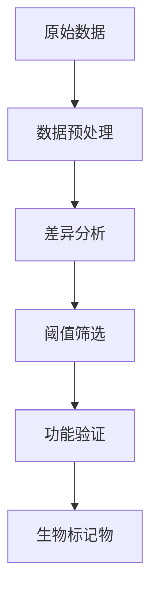

# 蛋白质组学数据分析方法

## 什么是蛋白质组学

蛋白质组学（Proteomics）是研究特定细胞、组织或生物体在特定条件下表达的所有蛋白质的科学。

## 质谱数据分析流程

### 1. 原始数据处理

```python
class MassSpecProcessor:
    """质谱数据处理器"""
    
    def __init__(self, raw_file):
        self.raw_file = raw_file
        
    def convert_raw(self, output_format="mzML"):
        """转换原始文件格式"""
        return f"converted.{output_format}"
    
    def peak_picking(self, noise_threshold=100):
        """峰检测"""
        return {"peaks": [], "intensities": []}
```

### 2. 定量分析

| 方法 | 原理 | 适用范围 |
|------|------|----------|
| Label-free | 基于谱图计数或峰面积 | 大样本量 |
| TMT | 多重同位素标记 | 10-18 个样本 |
| SILAC | 代谢标记 | 细胞培养 |

## 差异表达分析

```r
library(DESeq2)

differential_analysis <- function(count_matrix, metadata) {
  dds <- DESeqDataSetFromMatrix(countData = count_matrix, colData = metadata, design = ~ condition)
  dds <- DESeq(dds)
  results <- results(dds, contrast = c("condition", "treatment", "control"))
  return(results)
}
```

## 生物标记物发现



## 总结

蛋白质组学数据分析需要结合质谱技术和生物信息学方法。
